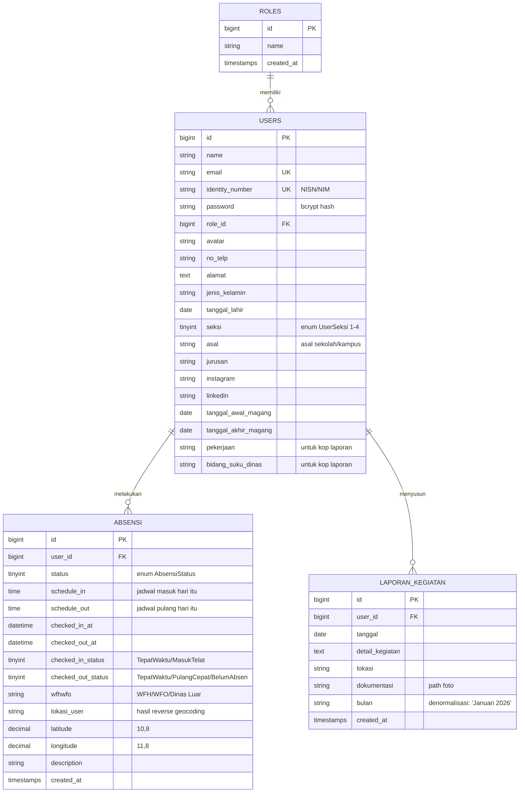
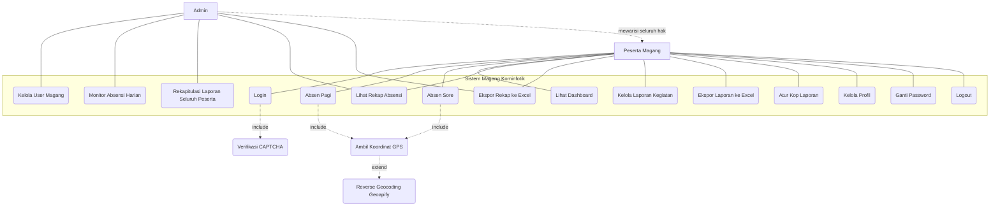
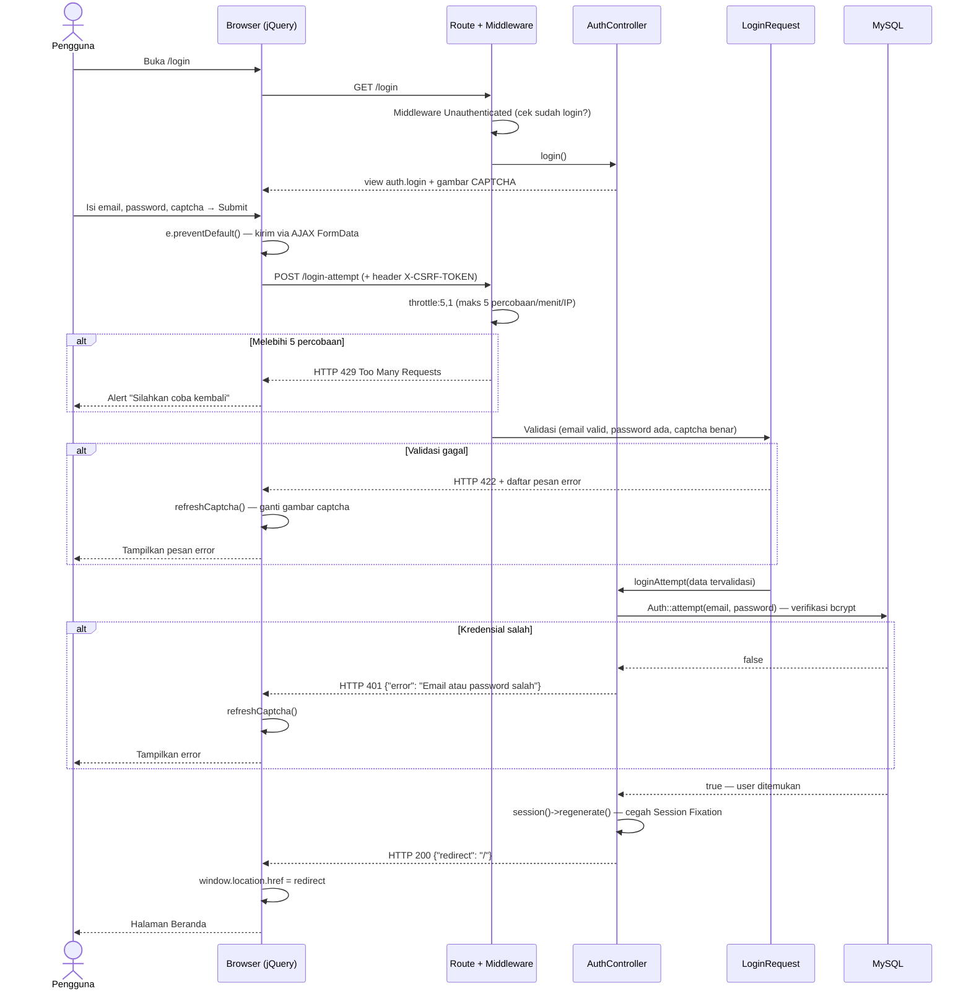
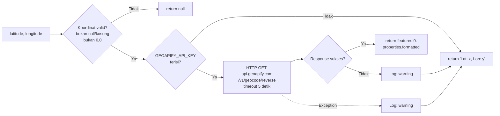
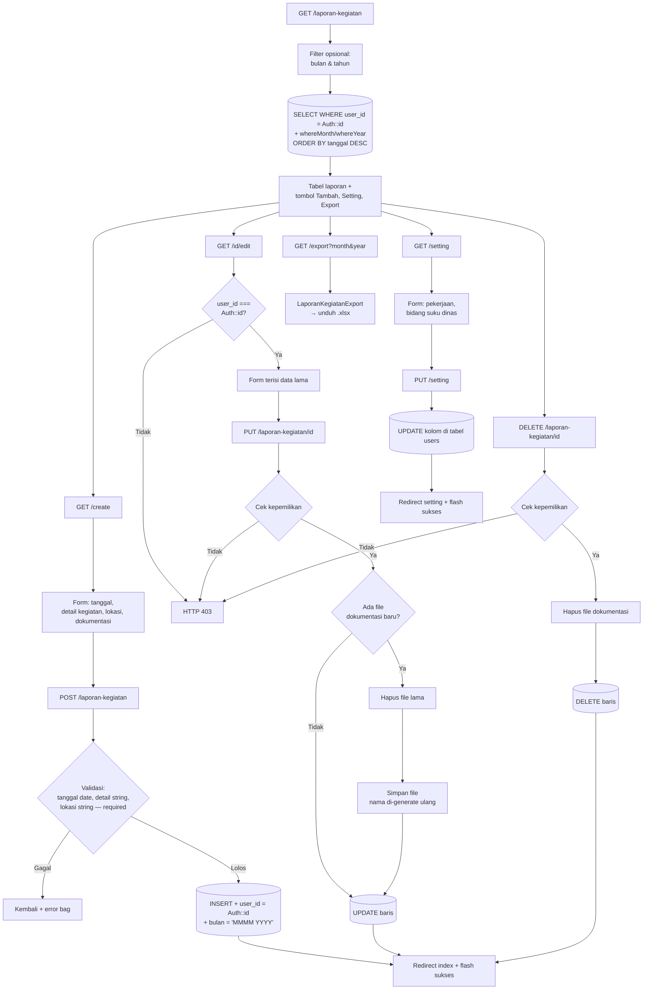
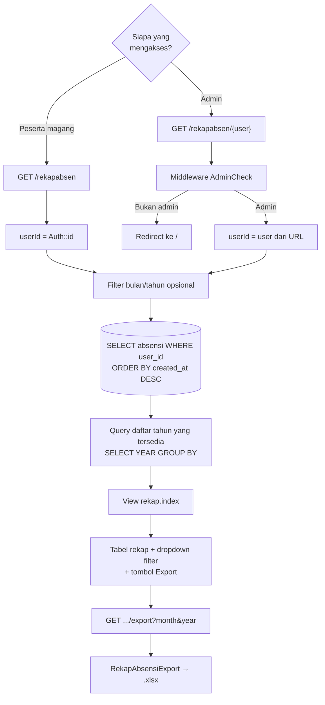
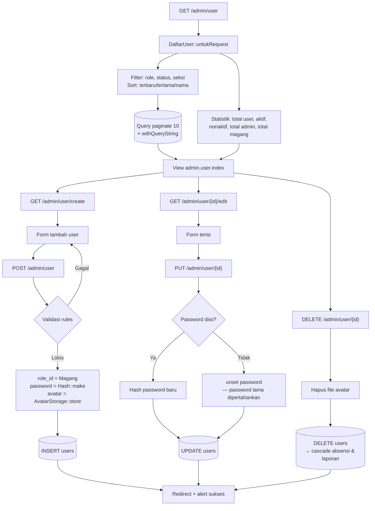
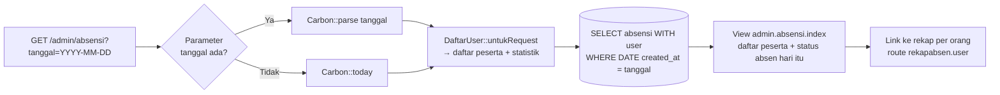
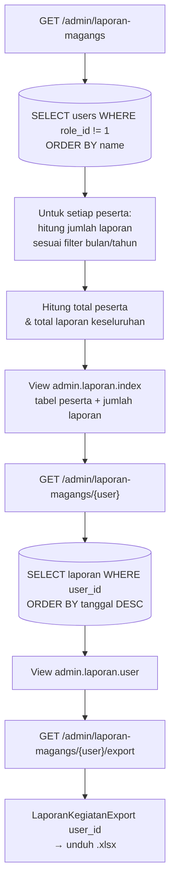

# Dokumentasi Alur Sistem — Sistem Informasi Absensi & Laporan Kegiatan Magang Kominfotik Jakarta Barat

> Dokumen ini merangkum arsitektur, alur proses, struktur data, aturan bisnis, dan pengujian aplikasi.
> Disusun sebagai bahan penulisan skripsi (khususnya BAB III Analisis & Perancangan Sistem, dan BAB IV Implementasi & Pengujian).

---

## 1. Identitas Sistem

| Aspek | Keterangan |
| --- | --- |
| Nama sistem | Sistem Magang Kominfotik |
| Instansi | Dinas Komunikasi, Informatika, dan Statistik (Kominfotik) Jakarta Barat |
| Domain masalah | Pencatatan kehadiran (absensi) dan pelaporan kegiatan harian peserta magang |
| Jenis aplikasi | Aplikasi web berbasis MVC (monolitik, server-side rendering) |
| Pengguna | 2 aktor: Admin (pembimbing/pengelola) dan Peserta Magang |
| URL lokal | `http://magang-kominfotik.test` (Laravel Herd) |

### 1.1 Latar Belakang Masalah (untuk BAB I)

Proses absensi peserta magang sebelumnya dilakukan manual (buku tamu / tanda tangan kertas),
sehingga menimbulkan permasalahan:

1. Tidak ada bukti waktu (timestamp) yang akurat — keterlambatan sulit diukur.
2. Tidak ada bukti lokasi — peserta yang WFH tidak dapat diverifikasi keberadaannya.
3. Rekapitulasi bulanan harus dihitung ulang secara manual oleh pembimbing.
4. Laporan kegiatan harian dikumpulkan dalam format bebas (Word/Excel) sehingga tidak seragam.

Sistem ini menjawab keempat masalah tersebut dengan pencatatan otomatis berbasis waktu server,
penangkapan koordinat GPS browser, kalkulasi keterlambatan otomatis, dan ekspor laporan ber-format
baku (Excel dengan kop instansi).

---

## 2. Teknologi & Lingkungan (Tech Stack)

| Lapisan | Teknologi | Versi |
| --- | --- | --- |
| Bahasa | PHP | ^8.1 |
| Framework | Laravel | ^10.10 |
| Basis data | MySQL | 8.x |
| Templating | Blade | bawaan Laravel |
| Frontend | Bootstrap 4 (tema *Purpose*), jQuery, ApexCharts, SweetAlert2, Select2, Flatpickr | — |
| Ekspor Excel | maatwebsite/excel (PhpSpreadsheet) | 3.1.56 |
| CAPTCHA | mews/captcha | ^3.4 |
| Token API | laravel/sanctum | ^3.3 |
| Reverse geocoding | Geoapify REST API | — |
| Peta | Google Maps Embed (iframe) | — |
| Pengujian | PHPUnit | ^10.1 |
| Server pengembangan | Laravel Herd (Nginx + PHP-FPM) | — |

### 2.1 Pola Arsitektur

Sistem menerapkan **MVC (Model–View–Controller)** yang diperluas dengan tiga lapisan pendukung:

```
Browser (Blade + jQuery/AJAX)
        │
        ▼
   ROUTES (routes/web.php)  ──► MIDDLEWARE (Authenticate, Unauthenticated, AdminCheck, throttle)
        │
        ▼
  CONTROLLER (9 controller, satu per fitur)
        │
        ├──► FORM REQUEST  (LoginRequest, PasswordRequest, UserRequest) — validasi
        ├──► SERVICE       (JadwalKerja, ReverseGeocoder, AvatarStorage) — logika domain
        ├──► QUERY OBJECT  (DaftarUser) — query kompleks yang dipakai >1 halaman
        ├──► EXPORT        (RekapAbsensiExport, LaporanKegiatanExport) — dokumen Excel
        │
        ▼
   MODEL / ELOQUENT ORM (User, Absensi, LaporanKegiatan, Role, GlobalConfiguration)
        │
        ▼
      MySQL
```

**Alasan penambahan lapisan Service** (poin analisis yang baik untuk skripsi):
sebelum refactor, jam kerja ditulis ulang di dua controller dengan nilai berbeda (14:00 vs 15:00),
sehingga jadwal yang ditampilkan di dashboard tidak sama dengan yang disimpan ke tabel absensi.
Kelas `JadwalKerja` menjadi *single source of truth* yang membaca `config/magang.php`.

---

## 3. Aktor dan Hak Akses

| Aktor | role_id | Hak akses |
| --- | --- | --- |
| **Admin** | 1 | Seluruh hak peserta magang **+** manajemen user (CRUD), monitoring absensi seluruh peserta pada tanggal tertentu, membuka & mengekspor rekap absensi peserta mana pun, rekapitulasi laporan kegiatan seluruh peserta |
| **Peserta Magang** | 2 | Absen pagi & sore, melihat dashboard pribadi, rekap absensi pribadi + ekspor, CRUD laporan kegiatan pribadi + ekspor, mengubah profil & password |

**Catatan penting untuk BAB Perancangan:** peserta magang **tidak dapat mendaftar sendiri**
(tidak ada halaman registrasi). Akun dibuat oleh Admin. Ini adalah keputusan desain karena peserta
magang adalah entitas yang sudah terverifikasi melalui surat pengantar kampus/sekolah.

### 3.1 Mekanisme Kontrol Akses

Kontrol akses diterapkan **hanya di lapisan route** melalui tiga middleware:

| Middleware | Fungsi | Perilaku saat gagal |
| --- | --- | --- |
| `Unauthenticated` | Menolak user yang sudah login mengakses halaman login | redirect ke `/` |
| `Authenticate` | Menolak tamu mengakses halaman internal | redirect ke `/login` (atau 401 JSON untuk AJAX) |
| `AdminCheck` | Hanya meloloskan `role_id == 1` | redirect ke `/` (atau 403 JSON untuk AJAX) |

`AdminCheck` menggunakan pola **allowlist** (`role_id != Role::Admin → tolak`), bukan blocklist.
Versi sebelumnya hanya menolak role Magang, sehingga penambahan role baru apa pun akan otomatis
memperoleh hak admin — ini adalah temuan keamanan yang diperbaiki dan layak dibahas di skripsi.

Selain middleware, terdapat **otorisasi tingkat objek** pada laporan kegiatan:
`pastikanMilikSendiri()` memanggil `abort_if($laporan->user_id !== Auth::id(), 403)` pada setiap
operasi edit/update/destroy — mencegah IDOR (Insecure Direct Object Reference).

---

## 4. Struktur Basis Data

### 4.1 Entity Relationship Diagram



### 4.2 Kardinalitas

| Relasi | Kardinalitas | Keterangan |
| --- | --- | --- |
| Role → User | 1 : N | Satu role dimiliki banyak user |
| User → Absensi | 1 : N | Satu user punya banyak baris absensi (**maksimal 1 baris per hari**) |
| User → LaporanKegiatan | 1 : N | Satu user punya banyak laporan (boleh >1 per hari) |

Kedua foreign key menggunakan `cascadeOnDelete` — menghapus user otomatis menghapus
seluruh absensi dan laporan miliknya.

### 4.3 Enumerasi (Enum)

**`AbsensiStatus`** (int, disimpan sebagai `tinyint`, di-*cast* otomatis oleh Eloquent):

| Nilai | Case | Teks | Warna | Dipakai di kolom |
| --- | --- | --- | --- | --- |
| 1 | Hadir | Hadir | success | `status` |
| 2 | Alpa | Alpa | danger | `status` |
| 3 | Izin | Izin | warning | `status` |
| 4 | Sakit | Sakit | info | `status` |
| 5 | TepatWaktu | Tepat Waktu | success | `checked_in_status`, `checked_out_status` |
| 6 | MasukTelat | Masuk Telat | warning | `checked_in_status` |
| 7 | PulangCepat | Pulang Cepat | warning | `checked_out_status` |
| 8 | BelumAbsen | Belum Absen | danger | `checked_out_status` |

**`Role`**: `Admin = 1`, `Magang = 2`

**`UserSeksi`** (bidang penempatan peserta magang):

| Nilai | Kode | Nama Lengkap |
| --- | --- | --- |
| 1 | ASTIK | Aplikasi Siber dan Statistik |
| 2 | ID | Infrastruktur Digital |
| 3 | KIP | Komunikasi dan Informasi Publik |
| 4 | TU | Tata Usaha |

### 4.4 Catatan Desain Basis Data

- Migrasi bersifat **idempotent** (`Schema::hasColumn` / `hasTable`) karena skema di server
  produksi sempat diubah manual di luar migrasi. Aman dijalankan ulang.
- Kolom `bulan` pada `laporan_kegiatan` adalah **denormalisasi terkontrol** (menyimpan
  "Januari 2026") untuk mempercepat pengelompokan pada ekspor — dapat dibahas sebagai
  trade-off normalisasi vs performa.
- Kolom `schedule_in` / `schedule_out` disalin ke setiap baris absensi (**snapshot**), bukan
  dibaca dari config saat menampilkan. Ini penting agar perubahan jam kerja di masa depan
  tidak mengubah status keterlambatan absensi historis.

---

## 5. Peta Route Lengkap

### 5.1 Grup Guest (middleware `Unauthenticated`)

| Method | URI | Controller@Method | Nama Route | Keterangan |
| --- | --- | --- | --- | --- |
| GET | `/login` | AuthController@login | `login` | Form login |
| POST | `/login-attempt` | AuthController@loginAttempt | `login-attempt` | + `throttle:5,1` |
| GET | `/refresh-captcha` | AuthController@refreshCaptcha | `refresh-captcha` | AJAX ganti captcha |

### 5.2 Grup Terautentikasi (middleware `Authenticate`)

| Method | URI | Controller@Method | Nama Route |
| --- | --- | --- | --- |
| POST | `/logout` | AuthController@logout | `logout` |
| GET | `/` | HomeController@index | `home` |
| GET | `/absensi` | AbsensiController@index | `absensi` |
| POST | `/absen/{tipe}` | AbsensiController@absen | `absen` |
| GET | `/profil` | ProfilController@index | `profil` |
| GET | `/profil/edit` | ProfilController@editProfil | `profil-edit` |
| POST | `/profil/update` | ProfilController@updateProfil | `profil-update` |
| POST | `/profil/update-password` | ProfilController@updateProfilPassword | `profil-update-password` |
| GET | `/rekapabsen` | RekapabsenController@index | `rekapabsen` |
| GET | `/rekapabsen/export` | RekapabsenController@export | `rekapabsen.export` |
| GET | `/laporan-kegiatan` | LaporanKegiatanController@index | `laporan-kegiatan.index` |
| GET | `/laporan-kegiatan/create` | LaporanKegiatanController@create | `laporan-kegiatan.create` |
| POST | `/laporan-kegiatan` | LaporanKegiatanController@store | `laporan-kegiatan.store` |
| GET | `/laporan-kegiatan/export` | LaporanKegiatanController@export | `laporan-kegiatan.export` |
| GET | `/laporan-kegiatan/setting` | LaporanKegiatanController@setting | `laporan-kegiatan.setting` |
| PUT | `/laporan-kegiatan/setting` | LaporanKegiatanController@settingUpdate | `laporan-kegiatan.setting.update` |
| GET | `/laporan-kegiatan/{id}/edit` | LaporanKegiatanController@edit | `laporan-kegiatan.edit` |
| PUT | `/laporan-kegiatan/{id}` | LaporanKegiatanController@update | `laporan-kegiatan.update` |
| DELETE | `/laporan-kegiatan/{id}` | LaporanKegiatanController@destroy | `laporan-kegiatan.destroy` |

> **Catatan teknis:** route berparameter (`/{laporanKegiatan}/edit`) sengaja didaftarkan
> **paling akhir** agar tidak "menelan" route statis `/create`, `/export`, dan `/setting`.
> Ini adalah perilaku pencocokan route Laravel yang berurutan (first-match-wins).

### 5.3 Grup Admin (middleware `Authenticate` + `AdminCheck`)

| Method | URI | Controller@Method | Nama Route |
| --- | --- | --- | --- |
| GET | `/rekapabsen/{user}` | RekapabsenController@index | `rekapabsen.user` |
| GET | `/rekapabsen/{user}/export` | RekapabsenController@export | `rekapabsen.user-export` |
| GET | `/admin/user` | AdminUserController@index | `admin-user` |
| GET | `/admin/user/create` | AdminUserController@create | `admin-user-create` |
| POST | `/admin/user` | AdminUserController@store | `admin-user-store` |
| GET | `/admin/user/{id}/edit` | AdminUserController@edit | `admin-user-edit` |
| PUT | `/admin/user/{id}` | AdminUserController@update | `admin-user-update` |
| DELETE | `/admin/user/{id}` | AdminUserController@destroy | `admin-user-destroy` |
| GET | `/admin/absensi` | AdminAbsensiController@index | `admin-absensi` |
| GET | `/admin/laporan-magangs` | AdminLaporanController@index | `admin-laporan.index` |
| GET | `/admin/laporan-magangs/{user}` | AdminLaporanController@show | `admin-laporan.user` |
| GET | `/admin/laporan-magangs/{user}/export` | AdminLaporanController@export | `admin-laporan.export` |

---

## 6. Use Case Diagram



---

## 7. Alur Proses Detail (Activity Flow)

### 7.1 Alur Autentikasi (Login)



**Aspek keamanan yang diterapkan pada alur login (bahan BAB Pembahasan):**

| Ancaman | Mitigasi | Implementasi |
| --- | --- | --- |
| Brute force | Rate limiting | `throttle:5,1` — 5 percobaan/menit/IP |
| Bot otomatis | CAPTCHA | `mews/captcha`, divalidasi di `LoginRequest` |
| Session fixation | Regenerasi session ID | `$request->session()->regenerate()` |
| CSRF | Token per-session | `@csrf` + header `X-CSRF-TOKEN` global via `$.ajaxSetup` |
| Password bocor dari DB | Hashing satu arah | bcrypt via cast `'password' => 'hashed'` |
| Enumerasi akun | Pesan error generik | "Email atau password salah" (tidak membedakan) |

**Alur Logout:** `POST /logout` → `Auth::logout()` → `session()->invalidate()` (hancurkan
seluruh data session) → `session()->regenerateToken()` (token CSRF lama tidak bisa dipakai
lagi) → redirect ke `/login`.

---

### 7.2 Alur Absensi (Fitur Inti)

Ini adalah proses bisnis utama sistem. Terdiri dari dua tahap dalam satu hari kerja.

```mermaid
flowchart TD
    Start([Peserta buka Beranda]) --> Cek{Sudah ada baris<br/>absensi hari ini?}

    Cek -->|Belum| Pagi[Tampilkan tombol<br/>ABSEN PAGI]
    Cek -->|Ada, checked_out_at kosong| Sore[Tampilkan tombol<br/>ABSEN SORE]
    Cek -->|Ada, checked_out_at terisi| Selesai[Tampilkan status<br/>ABSENSI SELESAI]

    Pagi --> Modal[Modal pilih mode kerja:<br/>WFH / WFO / Dinas Luar]
    Modal --> GPS

    Sore --> JamCek{Jam sistem<br/>>= 12:00?}
    JamCek -->|Tidak| Tolak[SweetAlert:<br/>Belum waktunya pulang]
    JamCek -->|Ya| GPS

    GPS[navigator.geolocation<br/>getCurrentPosition] --> GPSOk{GPS berhasil?}
    GPSOk -->|Ya| Kirim[AJAX POST /absen/tipe<br/>+ lat, lon, mode]
    GPSOk -->|Tidak/ditolak| Warn[Peringatan:<br/>dicatat tanpa koordinat] --> Kirim0[AJAX POST<br/>lat=0, lon=0]

    Kirim --> Server
    Kirim0 --> Server

    Server[AbsensiController@absen] --> Valid{Validasi:<br/>tipe, mode, koordinat}
    Valid -->|Gagal| E422[HTTP 422]
    Valid -->|Lolos| Geo[ReverseGeocoder::resolve]

    Geo --> Tipe{tipe = pagi<br/>atau sore?}

    Tipe -->|pagi| Dup{Sudah absen<br/>pagi hari ini?}
    Dup -->|Ya| E422b[HTTP 422:<br/>Sudah absen pagi]
    Dup -->|Tidak| Hitung1[Bandingkan waktu sekarang<br/>dengan JadwalKerja::jamMasuk]
    Hitung1 --> Insert[(INSERT absensi<br/>status=Hadir<br/>checked_in_status=<br/>TepatWaktu / MasukTelat<br/>checked_out_status=BelumAbsen)]

    Tipe -->|sore| Ada{Ada absen pagi?}
    Ada -->|Tidak| E404[HTTP 404:<br/>Data absen pagi<br/>tidak ditemukan]
    Ada -->|Ya| Dup2{checked_out_at<br/>sudah terisi?}
    Dup2 -->|Ya| E422c[HTTP 422:<br/>Sudah absen pulang]
    Dup2 -->|Tidak| Hitung2[Bandingkan waktu sekarang<br/>dengan JadwalKerja::jamPulang]
    Hitung2 --> Update[(UPDATE absensi<br/>checked_out_at<br/>checked_out_status=<br/>TepatWaktu / PulangCepat)]

    Insert --> Sukses[HTTP 200 + nama lokasi]
    Update --> Sukses
    Sukses --> Reload[SweetAlert sukses<br/>→ reload halaman]
    Reload --> End([Selesai])
```

#### 7.2.1 Aturan Bisnis Absensi

| No | Aturan | Implementasi |
| --- | --- | --- |
| BR-01 | Satu peserta hanya boleh **satu baris absensi per hari** | Cek `whereDate('created_at', today())` sebelum INSERT |
| BR-02 | Absen sore hanya bisa dilakukan bila absen pagi sudah ada | Return 404 bila baris tidak ditemukan |
| BR-03 | Absen pagi **wajib** memilih mode kerja (WFH/WFO/Dinas Luar) | `'wfhwfo' => 'required|in:WFH,WFO,Dinas Luar'` |
| BR-04 | Absen sore tidak perlu memilih mode kerja lagi | `'wfhwfo' => 'nullable'` saat tipe = sore |
| BR-05 | Masuk setelah jam masuk → **Masuk Telat** | `$now->greaterThan($jamMasuk)` |
| BR-06 | Pulang sebelum jam pulang → **Pulang Cepat** | `$now->lessThan($jamPulang)` |
| BR-07 | Jam pulang Jumat lebih lama (15:30) daripada Senin–Kamis (15:00) | `JadwalKerja::jamPulang()` cek `isFriday()` |
| BR-08 | Absen sore hanya boleh setelah pukul 12:00 | Validasi sisi klien (JavaScript) |
| BR-09 | Kegagalan GPS **tidak boleh** membatalkan absensi | Koordinat nullable, fallback `lat=0, lon=0` |
| BR-10 | Kegagalan layanan geocoding **tidak boleh** membatalkan absensi | `try/catch` → fallback string koordinat mentah |
| BR-11 | Lokasi absen pagi tidak boleh hilang saat absen sore tanpa GPS | `'lokasi_user' => $lokasi ?? $absensi->lokasi_user` |

#### 7.2.2 Sub-alur: Reverse Geocoding



Koordinat `0,0` sengaja dianggap tidak valid karena itu adalah nilai default yang dikirim
frontend ketika pengguna menolak izin lokasi browser.

#### 7.2.3 Kalkulasi Keterlambatan

Dijalankan oleh method statis `Absensi::kalkulasiKeterlambatan(Collection $absensi)`:

```
detikTelat = 0; detikPulangCepat = 0

untuk setiap baris absensi bulan ini:
    jika checked_in_status === MasukTelat:
        detikTelat += selisih detik (schedule_in, checked_in_at)
    jika checked_out_status === PulangCepat:
        detikPulangCepat += selisih detik (checked_out_at, schedule_out)

kembalikan:
    total_telat         = format HH:MM:SS (detikTelat)
    total_pulang_cepat  = format HH:MM:SS (detikPulangCepat)
    total_keterlambatan = format HH:MM:SS (detikTelat + detikPulangCepat)
```

> **Temuan bug yang layak dibahas di skripsi:** versi lama membandingkan status dengan
> integer mentah (`== 4`), padahal kolom sudah di-*cast* ke enum `AbsensiStatus`.
> Perbandingan tersebut selalu bernilai `false`, sehingga total keterlambatan di dashboard
> **selamanya menampilkan 00:00:00**. Perbaikannya: bandingkan dengan case enum
> (`=== AbsensiStatus::MasukTelat`). Ini contoh nyata pentingnya *type safety*.

---

### 7.3 Alur Dashboard (Beranda)

```mermaid
flowchart TD
    A[GET /] --> B[HomeController@index]
    B --> C[Query 1: 7 absensi terakhir<br/>ORDER BY created_at DESC LIMIT 7]
    B --> D[Query 2: seluruh absensi bulan berjalan<br/>WHERE YEAR dan MONTH = sekarang]
    B --> E[JadwalKerja::untukTampilan<br/>→ jam masuk & pulang hari ini]

    D --> F[kalkulasiKeterlambatan<br/>→ total telat, pulang cepat]
    D --> G[chartHarian<br/>→ array x/y/z per tanggal]
    D --> H[tahapAbsenHariIni<br/>→ 'pagi' / 'sore' / 'selesai']

    C --> V[View beranda.index]
    E --> V
    F --> V
    G --> V
    H --> V

    V --> R1[Kartu ringkasan:<br/>jadwal, total telat, pulang cepat]
    V --> R2[Grafik garis ApexCharts:<br/>jam masuk & pulang sebulan]
    V --> R3[Tabel 7 absensi terakhir<br/>+ tombol lihat peta]
    V --> R4[Tombol absen sesuai tahap]
```

**Struktur data grafik** (`Absensi::chartHarian`): sistem melakukan iterasi dari tanggal 1
sampai akhir bulan, lalu memetakan absensi berdasarkan tanggal. Hari tanpa absensi diisi
`null` sehingga garis grafik terputus — secara visual langsung menunjukkan hari bolong.

| Sumbu | Isi | Format |
| --- | --- | --- |
| x | Tanggal | `Y-m-d` |
| y | Jam masuk | detik sejak tengah malam (`secondsSinceMidnight()`) |
| z | Jam pulang | detik sejak tengah malam |

Konversi ke detik dilakukan agar dapat diplot sebagai nilai numerik; label sumbu Y
dikembalikan ke format jam oleh formatter JavaScript.

---

### 7.4 Alur Laporan Kegiatan (CRUD)



**Keamanan unggahan berkas** — nama file **selalu di-generate ulang** oleh sistem:

```php
$fileName = now()->format('YmdHis') . '_' . str()->random(16) . '.' . strtolower($ekstensi);
```

Alasannya: `getClientOriginalName()` sepenuhnya dikendalikan pengunggah, sehingga bisa
dipakai untuk menimpa file lain atau menyisipkan karakter path traversal (`../`).
Fungsi `basename()` juga dipakai saat menghapus, agar nilai dari database tidak bisa
keluar dari direktori yang ditentukan.

**Fitur Setting** memisahkan data kop laporan (`pekerjaan`, `bidang_suku_dinas`) dari data
laporan itu sendiri — data ini disimpan di tabel `users` karena bersifat tetap sepanjang
periode magang, sehingga tidak perlu diketik ulang setiap membuat laporan.

---

### 7.5 Alur Rekap Absensi



**Desain penting:** satu method `index()` melayani dua route berbeda dengan parameter
opsional `?User $user = null`. Karena parameter hanya terisi lewat route yang dijaga
`AdminCheck`, peserta magang **selalu** melihat rekapnya sendiri.

> **Temuan keamanan yang diperbaiki (IDOR):** sebelumnya route `/rekapabsen/{user}` hanya
> dijaga middleware `Authenticate`, sehingga peserta magang mana pun bisa membaca rekap
> absensi orang lain cukup dengan mengganti angka di URL. Kini route tersebut berada di
> dalam grup `AdminCheck`. Kasus ini memiliki test regresi khusus di `AksesKontrolTest`.

**Kolom pada file ekspor rekap absensi (15 kolom):**
Hari, Tanggal, Bulan, Tahun, Nama User, Jam Masuk, Status Masuk, Jam Keluar, Status Pulang,
Status Hari, Mode Kerja, Lokasi Absen, Latitude, Longitude, Keterangan (Hari Kerja/Hari Libur).

---

### 7.6 Alur Manajemen User (Admin)



**Aturan validasi user** (`AdminUserController::rules()`):

| Field | Aturan |
| --- | --- |
| name | required, string, max 255 |
| email | required, email, **unique** (mengabaikan baris sendiri saat update) |
| identity_number | required, string, max 50, **unique** (NISN/NIM) |
| password | required saat create / nullable saat update, min 6, **confirmed** |
| jenis_kelamin | nullable, in: Laki-laki, Perempuan |
| tanggal_lahir | nullable, date |
| asal, jurusan | nullable, string, max 255 |
| tanggal_awal_magang | nullable, date |
| tanggal_akhir_magang | nullable, date, **after_or_equal** tanggal_awal_magang |
| seksi | required, enum Seksi |
| no_telp | nullable, string, max 20 |
| instagram, linkedin | nullable, **url** |
| avatar | nullable, image, mimes jpeg/png/jpg, max 2048 KB |

**Penentuan status aktif/nonaktif** (`User::isActive()`): peserta dianggap **aktif** bila
`tanggal_akhir_magang` kosong ATAU masih di masa depan/hari ini. Logika ini juga tersedia
sebagai *query scope* (`scopeActive` / `scopeInactive`) sehingga dapat dipakai langsung di
level SQL untuk keperluan filter dan statistik.

---

### 7.7 Alur Monitoring Absensi Harian (Admin)



---

### 7.8 Alur Rekapitulasi Laporan Seluruh Peserta (Admin)



---

### 7.9 Alur Profil & Ganti Password

```mermaid
sequenceDiagram
    actor U as Peserta
    participant B as Browser
    participant C as ProfilController
    participant S as AvatarStorage
    participant DB as MySQL

    U->>B: GET /profil
    B->>C: index()
    C-->>U: Halaman profil (data dari auth()->user())

    U->>B: GET /profil/edit → ubah data → Submit
    B->>C: POST /profil/update (AJAX FormData)
    C->>C: Validasi: name, asal, jurusan,<br/>jenis_kelamin, alamat wajib; avatar opsional
    alt Ada file avatar
        C->>S: store(file, user)
        S->>S: Hapus avatar lama
        S->>S: Generate nama: YmdHis_random16.ext
        S-->>C: nama file
    end
    C->>DB: UPDATE users
    C-->>B: JSON {redirect: /profil} + flash alert
    B-->>U: Redirect ke halaman profil

    U->>B: Form ganti password
    B->>C: POST /profil/update-password
    C->>C: PasswordRequest:<br/>current_password benar,<br/>min 6, berbeda dari lama, confirmed
    alt Validasi gagal
        C-->>U: HTTP 422 + pesan berbahasa Indonesia
    end
    C->>DB: UPDATE password = Hash::make(baru)
    C-->>B: JSON {redirect: /profil}
```

> **Temuan keamanan yang diperbaiki:** versi lama menyimpan `encrypt($password)` ke kolom
> `remember_temp`. Enkripsi bersifat **reversibel** — siapa pun yang memiliki `APP_KEY`
> (misalnya melalui kebocoran file `.env` atau backup) dapat membaca password asli
> **seluruh pengguna** dalam bentuk plaintext. Kini password hanya disimpan sebagai
> hash bcrypt satu arah dan kolom `remember_temp` tidak lagi diisi.

**Pengingat kelengkapan data:** layout aplikasi memeriksa apakah ada atribut user yang
bernilai `null` (kecuali `remember_token`, `created_at`, `updated_at`). Bila ada, sebuah
banner muncul di setiap halaman mengarahkan peserta ke form edit profil.

---

## 8. Konfigurasi Sistem

Seluruh parameter operasional dipindahkan ke `config/magang.php` yang membaca `.env`,
sehingga tidak ada nilai jam kerja yang di-*hardcode* di dalam controller.

| Variabel `.env` | Default | Kegunaan |
| --- | --- | --- |
| `MAGANG_JAM_MASUK` | 09:00 | Batas absen dinyatakan tepat waktu |
| `MAGANG_JAM_PULANG` | 15:00 | Jam pulang Senin–Kamis |
| `MAGANG_JAM_PULANG_JUMAT` | 15:30 | Jam pulang Jumat |
| `GEOAPIFY_API_KEY` | (kosong) | Kunci API reverse geocoding |
| `GEOAPIFY_TIMEOUT` | 5 | Timeout permintaan geocoding (detik) |
| `CAPTCHA_DISABLE` | false | Menonaktifkan captcha (khusus lingkungan pengujian) |

Manfaat pendekatan ini: instansi dapat mengubah jam kerja tanpa menyentuh kode program
maupun melakukan *deployment* ulang.

---

## 9. Ringkasan Struktur Berkas

```
app/
├── Enums/
│   ├── AbsensiStatus.php    Hadir/Alpa/Izin/Sakit + TepatWaktu/Telat/PulangCepat/BelumAbsen
│   ├── Role.php             Admin = 1, Magang = 2
│   ├── Seksi.php            Enum untuk form (ASTIK/ID/KIP/TU)
│   ├── UserSeksi.php        Enum untuk cast model + nama lengkap seksi
│   ├── EnumArray.php        Trait helper (names/values/array)
│   └── EnumText.php         Interface: setiap enum wajib punya text()
├── Exports/
│   ├── LaporanKegiatanExport.php   Excel dengan kop instansi + gambar dokumentasi
│   └── RekapAbsensiExport.php      Excel 15 kolom rekap absensi
├── Http/
│   ├── Controllers/         9 controller, satu per fitur
│   ├── Middleware/
│   │   ├── AdminCheck.php       Satu-satunya penjaga akses admin
│   │   ├── Authenticate.php     Penjaga area terautentikasi
│   │   └── Unauthenticated.php  Penjaga area tamu
│   └── Requests/            LoginRequest, PasswordRequest, UserRequest
├── Models/                  User, Absensi, LaporanKegiatan, Role, GlobalConfiguration
├── Queries/
│   └── DaftarUser.php       Query daftar user + statistik (dipakai 2 halaman admin)
└── Services/
    ├── AvatarStorage.php    Simpan/hapus foto profil dengan nama file aman
    ├── JadwalKerja.php      Sumber tunggal jam masuk/pulang
    └── ReverseGeocoder.php  Koordinat GPS → nama lokasi

resources/views/
├── auth/login.blade.php
├── beranda/index.blade.php          Dashboard + grafik + tombol absen
├── absensi/index.blade.php          Riwayat absensi + modal peta
├── rekap/index.blade.php            Rekap + filter + export
├── laporan-kegiatan/                index, create, edit, setting, export
├── profil/                          index, edit-profil
├── admin/user/                      index, create, edit
├── admin/absensi/index.blade.php
├── admin/laporan/                   index, user
├── layout/                          app, navbar, header, footer, search
└── components/alert.blade.php
```

---

## 10. Pengujian Perangkat Lunak

Pengujian menggunakan **PHPUnit** dengan pendekatan *Feature Test* (menguji alur HTTP
end-to-end, bukan unit terisolasi). Total **49 test case** dalam 5 berkas.

> Catatan metodologi: pengujian memakai MySQL, bukan SQLite in-memory, karena query
> rekapitulasi menggunakan fungsi SQL `YEAR()` yang perilakunya berbeda antar-DBMS.
> Ini menjaga kesetaraan antara lingkungan uji dan produksi.

| Berkas Uji | Jumlah | Cakupan |
| --- | --- | --- |
| `AbsensiTest` | 14 | Alur absen pagi/sore, status telat & pulang cepat, jadwal Jumat, pencatatan lokasi, penanganan geocoding gagal |
| `AksesKontrolTest` | 12 | Pembatasan admin, kepemilikan laporan, pencegahan akses rekap milik orang lain (regresi IDOR) |
| `KeterlambatanTest` | 9 | Kalkulasi durasi telat/pulang cepat, penentuan tahap tombol absen, konsistensi jadwal dashboard |
| `LaporanKegiatanTest` | 8 | CRUD laporan, filter bulan/tahun, pengaturan pekerjaan/bidang |
| `AuthTest` | 6 | Login, throttle 5 percobaan/menit, logout, ganti password |

### 10.1 Usulan Tabel Black-Box Testing (untuk BAB IV)

| No | Skenario | Masukan | Hasil yang Diharapkan | Status |
| --- | --- | --- | --- | --- |
| 1 | Login berhasil | Email & password benar, captcha benar | Redirect ke Beranda | Valid |
| 2 | Login gagal | Password salah | Pesan "Email atau password salah" | Valid |
| 3 | Login gagal | Captcha salah | Pesan "Captcha salah", gambar captcha diganti | Valid |
| 4 | Proteksi brute force | 6× percobaan gagal dalam 1 menit | HTTP 429 (diblokir sementara) | Valid |
| 5 | Absen pagi | Pilih WFO, izinkan GPS | Baris absensi tersimpan, status Hadir | Valid |
| 6 | Absen pagi ganda | Absen pagi 2× dalam sehari | Pesan "Anda sudah melakukan absen pagi" | Valid |
| 7 | Deteksi keterlambatan | Absen pukul 09:15 (jadwal 09:00) | `checked_in_status` = Masuk Telat, total telat 00:15:00 | Valid |
| 8 | Absen sore tanpa pagi | Absen sore langsung | Pesan "Data absen pagi tidak ditemukan" | Valid |
| 9 | Deteksi pulang cepat | Absen pulang 14:00 (jadwal 15:00) | `checked_out_status` = Pulang Cepat | Valid |
| 10 | Jadwal Jumat | Absen pulang hari Jumat 15:15 | Dianggap Pulang Cepat (jadwal 15:30) | Valid |
| 11 | GPS ditolak | Tolak izin lokasi browser | Absensi tetap tersimpan tanpa koordinat | Valid |
| 12 | Layanan geocoding mati | API Geoapify tidak merespons | Lokasi tersimpan sebagai koordinat mentah | Valid |
| 13 | Kontrol akses admin | Peserta magang membuka `/admin/user` | Redirect ke Beranda | Valid |
| 14 | Pencegahan IDOR | Peserta membuka `/rekapabsen/{id_orang_lain}` | Redirect ke Beranda | Valid |
| 15 | Kepemilikan laporan | Peserta mengedit laporan milik orang lain | HTTP 403 Forbidden | Valid |
| 16 | Validasi periode magang | Tanggal akhir < tanggal awal | Pesan validasi ditolak | Valid |
| 17 | Duplikasi identitas | Membuat user dengan NISN/NIM yang sudah ada | Pesan validasi unik | Valid |
| 18 | Ekspor rekap absensi | Klik Export dengan filter bulan | Berkas `.xlsx` terunduh dengan data terfilter | Valid |
| 19 | Ekspor laporan kegiatan | Klik Export | Berkas `.xlsx` dengan kop instansi & foto dokumentasi | Valid |
| 20 | Logout | Klik Logout | Session dihancurkan, redirect ke halaman login | Valid |

---

## 11. Rangkuman Aspek Keamanan (bahan BAB Pembahasan)

| Kategori OWASP | Ancaman | Mitigasi dalam sistem |
| --- | --- | --- |
| A01 Broken Access Control | Peserta mengakses data peserta lain | `AdminCheck` di level route + pengecekan kepemilikan objek (`abort_if`) |
| A02 Cryptographic Failures | Password reversibel | Hash bcrypt satu arah; kolom `remember_temp` (encrypt) ditinggalkan |
| A03 Injection | SQL Injection | Eloquent ORM + *prepared statement*; Blade auto-escaping mencegah XSS |
| A04 Insecure Design | Role baru otomatis jadi admin | Kontrol akses diubah dari *blocklist* ke *allowlist* |
| A05 Security Misconfiguration | Logika akses tersebar | Disentralisasi ke satu middleware |
| A07 Auth Failures | Brute force, bot, session fixation | Rate limiting 5/menit, CAPTCHA, regenerasi session ID |
| A08 Data Integrity | Unggahan file berbahaya | Nama file di-generate ulang, validasi MIME & ukuran, `basename()` saat hapus |
| CSRF | Permintaan lintas situs | Token CSRF pada seluruh form & permintaan AJAX |

---

## 12. Keterbatasan Sistem & Saran Pengembangan

Bagian ini berguna untuk sub-bab "Keterbatasan Penelitian" dan "Saran".

**Keterbatasan yang teridentifikasi:**

1. **Belum ada validasi radius lokasi (geofencing).** Koordinat dicatat, tetapi sistem
   tidak menolak absensi yang dilakukan jauh dari kantor. Data lokasi bersifat informatif
   untuk verifikasi manual oleh pembimbing.
2. **Validasi waktu absen sore (>= 12:00) hanya di sisi klien**, sehingga dapat dilewati
   oleh pengguna yang memodifikasi permintaan. Validasi ini perlu dipindahkan ke server.
3. **Belum ada penanganan izin/sakit.** Enum `AbsensiStatus` sudah menyediakan case `Izin`,
   `Sakit`, dan `Alpa`, tetapi belum ada antarmuka pengajuannya — seluruh absensi yang
   tersimpan berstatus `Hadir`.
4. **Belum ada penandaan hari libur nasional.** Ekspor hanya membedakan Sabtu/Minggu
   sebagai "Hari Libur".
5. **Form tambah laporan menyediakan input dokumentasi, namun method `store()` belum
   memproses berkas tersebut** — unggahan dokumentasi baru berfungsi pada proses edit.
   (Perlu diperbaiki sebelum sidang.)
6. **Halaman `/admin/absensi` belum memiliki tautan di menu navigasi** dan tampilannya
   masih menggunakan salinan tabel manajemen user.
7. **Belum ada fitur lupa password** — reset password harus dilakukan oleh Admin.
8. **Belum ada notifikasi** (email/WhatsApp) untuk pengingat absen.

**Saran pengembangan:**

- Geofencing berbasis radius (formula Haversine) terhadap koordinat kantor.
- Modul pengajuan izin/sakit dengan unggahan surat keterangan dan alur persetujuan.
- Tabel hari libur nasional yang dapat dikelola Admin.
- Pemindahan validasi waktu absen ke sisi server.
- Penerbitan sertifikat/lembar penilaian magang otomatis di akhir periode.
- Progressive Web App (PWA) agar dapat diakses seperti aplikasi mobile.

---

## 13. Kerangka Bab yang Disarankan

| Bab | Isi yang bisa diambil dari dokumen ini |
| --- | --- |
| **BAB I Pendahuluan** | Bagian 1.1 (latar belakang masalah), rumusan masalah dari 4 poin permasalahan, batasan masalah dari Bagian 12 |
| **BAB II Landasan Teori** | Bagian 2 (Laravel, MVC, Eloquent ORM, Blade, MySQL, REST/AJAX, Geolocation API, reverse geocoding, bcrypt, CSRF, black-box testing) |
| **BAB III Analisis & Perancangan** | Bagian 3 (aktor & hak akses), 4 (ERD & struktur tabel), 5 (peta route), 6 (use case), 7 (activity/sequence diagram seluruh fitur), 8 (konfigurasi) |
| **BAB IV Implementasi & Pengujian** | Bagian 7 (potongan logika inti), 9 (struktur berkas), 10 (pengujian & tabel black-box), 11 (aspek keamanan), tangkapan layar antarmuka |
| **BAB V Penutup** | Kesimpulan dari pemenuhan rumusan masalah + Bagian 12 (keterbatasan & saran) |

---

## 14. Instruksi untuk Penulisan Skripsi

> Bagian ini dapat disalin bersama dokumen di atas ketika meminta bantuan penulisan.

Dokumen di atas adalah hasil pemetaan menyeluruh terhadap kode sumber aplikasi
"Sistem Magang Kominfotik". Gunakan sebagai **sumber kebenaran tunggal** — jangan
mengarang fitur, tabel, atau kolom yang tidak tercantum di dalamnya.

Hal-hal yang perlu diperhatikan saat menulis:

1. Seluruh nama tabel, kolom, route, dan kelas harus persis sama dengan dokumen ini.
2. Sistem **tidak memiliki** fitur registrasi mandiri, lupa password, notifikasi,
   geofencing, maupun pengajuan izin/sakit. Jangan menuliskannya sebagai fitur yang ada.
3. Temuan-temuan perbaikan (bug enum keterlambatan, IDOR rekap absensi, `remember_temp`
   yang reversibel, kontrol akses blocklist) adalah nilai tambah penelitian — layak
   dibahas sebagai bagian dari proses rekayasa perangkat lunak, bukan disembunyikan.
4. Gunakan bahasa Indonesia baku sesuai PUEBI, kalimat pasif untuk metodologi.
5. Diagram dalam dokumen ini ditulis dengan sintaks Mermaid; untuk skripsi, gambar ulang
   sebagai UML standar (Use Case, Activity, Sequence, Class Diagram) memakai draw.io
   atau StarUML.
